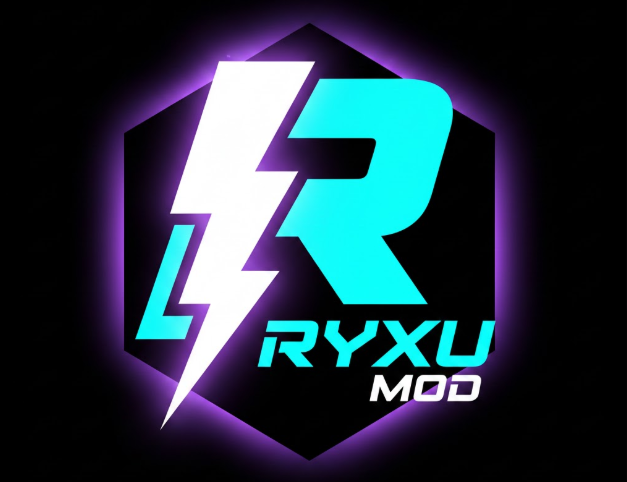

# Ryxu Mod
A **mini mod** for Geometry Dash by [ryxu-xo](https://github.com/ryxu-xo).

---

## Features
- Practice Music Sync unlocker (own the feature, no desync)
- FPS/CPS overlay with RGB effects
- Menu button fallback for easy access
- Settings menu with live toggles
- Icon unlocker (unlock all icons)
- Noclip (ignore death collisions)
- Show hitboxes (debug collider visualization)
- Auto checkpoints (auto create checkpoints)

---

## How to Use
1. Install the .geode package using Geode SDK.
2. Open Geometry Dash and enjoy the mod features!
3. Configure settings in-game for overlays, Practice Music Sync, icon unlocker, noclip, and more.

---

## Why "Mini Mod"?
Ryxu Mod is designed to be lightweight and simple—no bloat, just useful features. Perfect for users who want quick enhancements without constant updates or huge menus.

---

## Credits
- [ryxu-xo](https://github.com/ryxu-xo) (Lead dev)
- Geode SDK team
- GD modding community

---

## License
**Ryxu Mod** is released under the MIT License.

---

## Other Notes
- Suggestions, issues, or contributions? Open an issue or PR on GitHub.
- Donations/support: see [support.md](support.md).
- Enjoy using Ryxu Mod!
